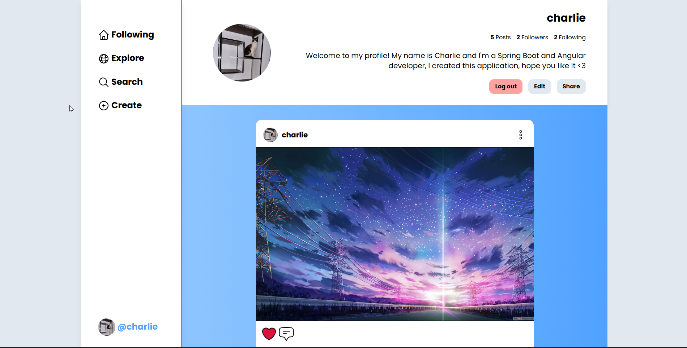

# Social-Konnect frontend

This is a personal project I have been building out for a couple of months to learn Spring Boot & Angular while creating a reasonably complex application.

It is a Social media style application, similar to twitter in some ways, it includes User profiles, posts, comments, and likes, as well as the logic for users following each other. 

This repository is the frontend of the application, using Angular 19.1.

During the development of this codebase, I implemented many things such as:

- Routing with lazy-loading
- RxJs & Signals for reactive state management
- Authentication handling using guards & interceptors
- API calls to paginated & non-paginated endpoints
- Route resolvers to retrieve data before a component is loaded

# Development server

To start a local development server, run:

```bash
ng serve
```

Once the server is running, open your browser and navigate to `http://localhost:4200/`. The application will automatically reload whenever you modify any of the source files.
